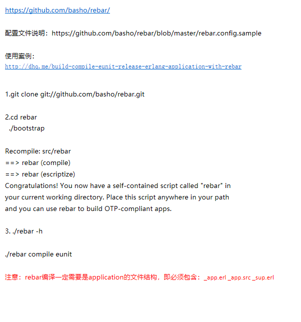

<https://github.com/basho/rebar/>

配置文件说明：<https://github.com/basho/rebar/blob/master/rebar.config.sample>

使用案例：
<http://dhq.me/build-compile-eunit-release-erlang-application-with-rebar>

1.git clone git://github.com/basho/rebar.git

2.cd rebar
  ./bootstrap

Recompile: src/rebar
==> rebar (compile)
==> rebar (escriptize)
Congratulations! You now have a self-contained script called "rebar" in
your current working directory. Place this script anywhere in your path
and you can use rebar to build OTP-compliant apps.

3.
  ./rebar -h
  ./rebar compile eunit

注意：rebar编译一定需要是application的文件结构，即必须包含：_app.erl_app.src_sup.erl

